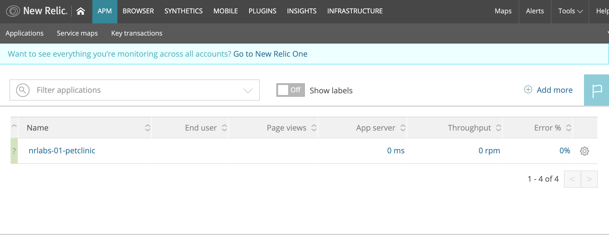

# New Relic Integration Exapmele with Spring PetClinic Sample Application

*Japanese explanation follows English.*

By this, you can quickly try application performance monitoring by New Relic, and can know what you need to configure for monitoring. 

## Target application
This example uses the famous Java application: <a href="https://github.com/spring-projects/spring-petclinic" target="_blank">Spring Petclinic</a>. 

## What is done by this
- Build the Spring Petclinic application and deploy it to AWS
- Install New Relic APM agent on application server to monitor the Java application. See detail <a href="https://docs.newrelic.com/docs/agents/java-agent/installation/install-java-agent">here</a>
- (Optional) Install New Relic Browser agent

## Prerequisite
- New Relic account
    - APM license
    - (Optional) Browser license
- Amazon Web Services account to use AWS CloudFormation, EC2, S3 where the application is deployed.
- AWS CLI (aws) is installed in your local environment
- AWS S3 bucket to upload application archive (jar)
- Basic Linux Command to run shell script (newrelic-labs/configurations/01_petclinic/build.sh)
- (If you use Mac) GNU sed needs to be installed in your local environment 

## Steps
### Clone the repository and go to project folder

```
git clone https://github.com/ktst79/newrelic-labs.git
cd newrelic-labs/configurations/01_petclinic
```


### Specify parameters depending on your own environemnt
Open build_param.sh

| Parameter | Explanation       | Default |
|--------------------------|-----------------------|---|
|NR_LICENSEKEY | License key of New Relic, which you can obtain it from New Relic page ||
|NR_APP_NAME | Application name to identify the application, which is configured in New Relic agent and shown in New Relic screen ||
|AWS_KEY_NAME | AWS Key Name to access EC2 instance after deploying the application. This is set to EC2 instance through CloudFormation. ||
|AWS_S3_PATH | AWS S3 path to which jar file is uploaded after compilation. Appliation server (EC2 instance) will access the file on S3 to deploy application. ||
|AWS_AMIROLE_S3ACCESS | AMI Role to access S3 from EC2. The role will be assigned to EC2 instance. ||
|AWS_CF_STACK | CloudFormation stack name. | nrlabs-01-petclinic |
|AWS_CF_TEMPLATE | CloudFormation template name. | ./resources/cloudformation/cloudformation.yaml |
|AWS_AP_AMIID | AMI ID for EC2 instance. <span style="color:red;">This needs to be changed if you would like to deploy application to other region.</span> | ami-068a6cefc24c301d2 (Amazon Linux) |
|APP_URL | Download URL of Spring Application | https://github.com/spring-projects/spring-petclinic/archive/master.zip |
|APP_NAME | Folder name (Shown after unzip download file) | spring-petclinic-master |
|FORCE_TO_DELETE_STACK | Forcibly delete exisiting stack with same name to overwirte the application | enable |

### Deploy the application

Just run following script to deploy application after settting parameters in previous step.
```
./build.sh
```

If you specify parameters in the other file, you can specify it with "-p" optin.
```
./build.sh -p <parameter file>
```

### (Optional) Enable Browser agent
Yeild following steps if you would like to monitor performance on browser side. Basically New Relic Browser agent will be embeded automatically by APM agent. However, need to embed Javascript code of Browser agent if Java application doesn't use jsp (Spring Application uses Thymeleaf instead of jsp).

#### Get Javascript Code from New Relic
Get Javascript code for Browser agent. See detail <a href="https://docs.newrelic.com/docs/browser/new-relic-browser/installation/install-new-relic-browser-agent#copy-paste-app">here</a>.

#### Copy the code and put 
Save file with the Javascript code. For example, ./resources/agents/browser_agent. This file must contains &lt;script&gt; tag.

#### Run build.sh  
Save file with the Javascript code. For example, ./resources/agents/browser_agent
```
./build.sh -b <The file created in previous step>
```

## Check the application
The script "build.sh" shows DNS name of EC2 instance where application is running as outputs of CloudFormation.
Access the application https://&lt;DNS Name&gt;:8080/.


## Check New Relic
Access New Relic and check if the application is monitored by New Relic. If the appllication "nrlabs-01-petclinic" is shown, configuration is done successfully.


# License

The Spring PetClinic sample application is released under version 2.0 of the [Apache License](https://www.apache.org/licenses/LICENSE-2.0).

